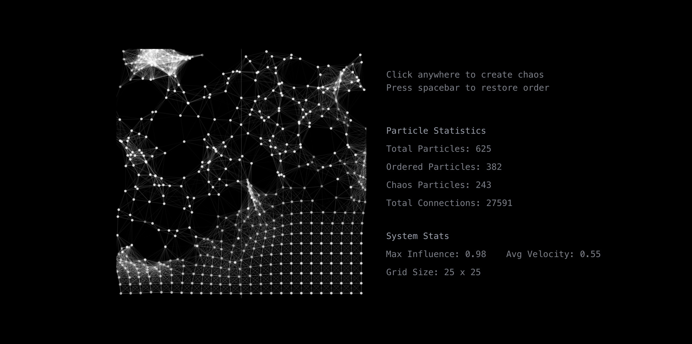

# Entropy Particle System



A React-based interactive particle system that demonstrates the concept of entropy through a visual simulation of order and chaos.

## Overview

This project visualizes the concept of entropy using an interactive particle system. Each particle exists in either an ordered or chaotic state, influencing nearby particles through a sophisticated neighbor system. Users can interact with the system by clicking to introduce chaos or pressing the spacebar to restore order.

## Tech Stack

- **Framework**: React 18+ (Next.js)
- **Language**: TypeScript
- **Styling**: Tailwind CSS
- **Animation**: Canvas API
- **Utils**: cn (classnames utility)

## Mathematical Concepts

The simulation uses several mathematical functions and concepts:

### Distance Calculation (Euclidean)
```typescript
const distance = Math.hypot(particle.x - other.x, particle.y - other.y)
```

### Velocity & Position Updates
```typescript
velocity.x += (Math.random() - 0.5) * 0.5
velocity.y += (Math.random() - 0.5) * 0.5
velocity.x *= 0.95  // Dampening
velocity.y *= 0.95  // Dampening
```

### Influence Calculation
```typescript
const strength = Math.max(0, 1 - distance / 100)
chaosInfluence.x += (neighbor.velocity.x * strength)
chaosInfluence.y += (neighbor.velocity.y * strength)
```

## Usage

```typescript
import { Entropy } from '@/components/ui/entropy'

export default function Demo() {
  const handleStatsUpdate = (stats: {
    avgChaosVelocity: number
    maxInfluence: number
    particleCount: number
    orderedParticles: number
    chaosParticles: number
    totalConnections: number
  }) => {
    console.log('System Stats:', stats)
  }

  return (
    <Entropy 
      size={400} 
      onStatsUpdate={handleStatsUpdate}
      className="rounded-lg shadow-lg"
    />
  )
}
```

## Component API

### Props

| Prop | Type | Default | Description |
|------|------|---------|-------------|
| `size` | `number` | `400` | Canvas size in pixels |
| `className` | `string` | `undefined` | Additional CSS classes |
| `onStatsUpdate` | `function` | `undefined` | Callback for system statistics |

### Statistics Output

The `onStatsUpdate` callback provides:
- `avgChaosVelocity`: Average velocity of chaotic particles
- `maxInfluence`: Maximum influence value in the system
- `particleCount`: Total number of particles
- `orderedParticles`: Count of particles in order
- `chaosParticles`: Count of particles in chaos
- `totalConnections`: Total particle connections

## Core Features

1. **Particle Grid System**
   - 25x25 grid of particles
   - Each particle maintains original position memory
   - Dynamic neighbor detection within 100px radius

2. **State Management**
   ```typescript
   class Particle {
     order: boolean        // Ordered vs Chaotic state
     influence: number     // Influence from nearby particles
     isChaosSource: boolean // Whether particle is a chaos source
     // ... other properties
   }
   ```

3. **Interactive Features**
   - Click to create chaos in a radius
   - Spacebar to restore system order
   - Real-time statistics updates

4. **Physics Implementation**
   - Velocity-based movement
   - Boundary collision detection
   - Influence propagation
   - Dampening effects

## Implementation Details

### Particle Class
```typescript
class Particle {
  constructor(x: number, y: number, order: boolean, isChaosSource = false) {
    this.x = x
    this.y = y
    this.originalX = x
    this.originalY = y
    this.size = 2
    this.order = order
    this.velocity = {
      x: (Math.random() - 0.5) * 2,
      y: (Math.random() - 0.5) * 2
    }
    this.influence = 0
    this.neighbors = []
    this.isChaosSource = isChaosSource
  }
}
```

### Neighbor System
```typescript
function updateNeighbors() {
  particles.forEach(particle => {
    particle.neighbors = particles.filter(other => {
      if (other === particle) return false
      const distance = Math.hypot(particle.x - other.x, particle.y - other.y)
      return distance < 100
    })
  })
}
```

# Credit

I initially found a componenet on 21st.dev made by Kain0127. This was my main source
of inspiration. I wanted to make his componenet interactive and wanted to add details.
The orignal componenet can be found here: https://21st.dev/xubohuah/entropy/default
